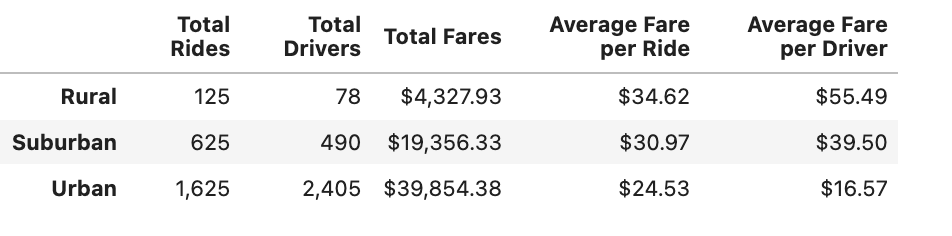
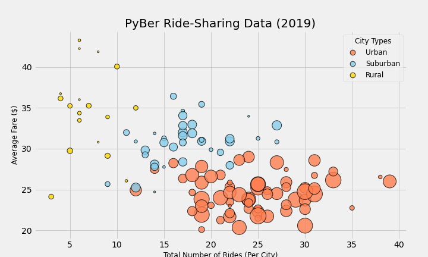

# PyBer_Analysis

## Overview of the Aalysis
This is an analysis of the PyBer ride-sharing data from January 2019 to May 2019. 

### Purpose
In this report we will be looking into the fare metrics based on the types of cities. The purpose is to understand and help improve access to ride sharing services and determine affordability for undeserved neighborhood. 

## Result of the Analysis

### Differences in ride share data among the different city types

- Rural :
    There are 125 total rides and 78 total drivers. The total fare is $4,327.93 for rural cities. The average fare per ride is $34.62 and the average fare per driver is $55.49.

- Suburban :
    There are 625 total rides and 490 total drivers. The total fare is $19,356.33 for suburban cities. The average fare per ride is $30.97 and the average fare per driver is $39.50.

- Urban :
    There are 1,625 total rides and 2,405 total drivers. The total fare is $39,854.38 for urban cities. The average fare per ride is $24.53 and the average fare per driver is $16.57.

### Explanation of this result
Based on these differences, it is clear that Urban cities have highest number of rides and rural cities have the least number of rides. Urban cities also has a higher number of drivers. 

From the chart above it is also clear that rural cities pay more on average compared to suburban and urban cities.

### Total Fare by City Type from Jan 2019 - May 2019
Taking a closer look at the data specifically for the time frame January 2019 to May 2019, we see that PyBer ridesharing company has more total fares and revenue in urban cities rather than suburban and rural cities.

## Summary
While there more rides and drivers in urban cities, the rural cities are more profitable on average. Urban cities have the highest revenue when it comes to total fare.

### Three business recommendations 

- The demand for rides in rural and suburban cities are more than then drivers in these two cities. Given the average fare per ride in these cities is higher than urban cities, I would recommend to provide more drivers to rural and urban cities.

- Urban cities have more drivers than rides, I would recommend on providing more incentives to increase rides in these cities. Currently, Urban cities have the highest revenue, but if we provide more incentives to the riders, and increase the number of riders then, urban cities, fares might be even higher.

- I would also recommend to collect data of distance travelled in each of these cities and determine the average fare per km travelled. This can be used to understand which cities riders travels the furthest. Longer the ride the more profitable the ride will be. Based on this new data we can determine which city to focus furthermore. 

